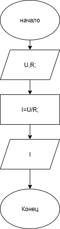

# homework3.1

##Условие задачи
Написать и отладить программу вычисления силы тока по
известным значениям напряжения и сопротивления электрической
цепи.

##1. Алгоритм и блок-схема

### Алгоритм
1. **Начало**
2. Задать исходные данные:
   - `U` - напряжение (В).
   - `R` - сопротивление (Ом).
3. Вычислить силу тока:
   - `I` = `U` / `R`
4. Вывести результат расчёта.
5.  **Конец**

### Блок-схема

([https://app.diagrams.net/?page-id=vKg7L8X21BIwSFlcxruJ#HIvan-Gus%2Fhomework3.1%2Fmain%2F%D0%B7%D0%B0%D0%B4%D0%B0%D0%BD%D0%B8%D0%B53.1.drawio#%7B%22pageId%22%3A%22Hare0p7KD6Ot46MpYtaQ%22%7D](https://app.diagrams.net/?tags=%7B%7D&lightbox=1&highlight=0000ff&edit=_blank&layers=1&nav=1&title=%D0%B7%D0%B0%D0%B4%D0%B0%D0%BD%D0%B8%D0%B53.1.drawio&dark=auto#R%3Cmxfile%3E%3Cdiagram%20name%3D%22%D0%A1%D1%82%D1%80%D0%B0%D0%BD%D0%B8%D1%86%D0%B0%20%E2%80%94%201%22%20id%3D%22Hare0p7KD6Ot46MpYtaQ%22%3E7Vhdb9owFP01edyUxEDgsSWUTdqqbqja%2Buglt4knJ46MgaS%2FfjfEJl9U0EoMNvFifI%2BvP%2B65xxeDRaZJPpc0i7%2BKELjl2mFuEd9y3eHIwbYEigrwPK8CIsnCCnJqYMFeQIO2RlcshGXLUQnBFcvaYCDSFALVwqiUYtN2exa8vWtGI%2BgBi4DyPvqDhSqu0LHr1fgnYFFsdnZGk2okocZZR7KMaSg2DYjMLDKVQqiql%2BRT4CV3hpdq3t0ro7uDSUjVMRPuf43nj0H6UnxT4aT47X3J1vcf9Cprylc6YMu3rVt%2F29qW71hjz%2FSxvd22Mx2QKgxLuBMmBI3bTcwULDIalCMblARisUo4Wg52%2B4c2JwCpIG9AOog5iASULNBFjxKiCdWKMvxu6vQ4BosbqRlrjGpFRLuVa9Kwo3l7A4duj8NHy51%2B30Xb4Ak1kJVdJIByDlxEkibomIFkeBiQ3bGHeuAQtc8sB3OBTkS1cyzXo1NxTXpcf8YP5PtuL99SrNIQygXt82jTOTdhgz2E%2FWeqJPa5SR7uraKTG10t64o63FbU0UXVz8Gx9J2sgHp9%2BnoEpeFN%2BW2OVsDpcsmCNi%2Ftiw45Uz%2FL%2Fsehtp60X9n384abXxgjxVAak0rzqTlWT9taZt6rGVmKlQzg8NVUVEagDqsLwtZLpZ%2FfRv6Ge9JnMAmcKrZuv2%2F25VTv8CAYRlbLZ9KRD%2BnIoopbz2q%2BRzoLDQada9zVV0VMb6GtxHZhv19140tQ3fvVQ45Uz%2BCqnlOoZ3IJ6vn7Ncs9UnXkqrpTqM48J%2F%2FVomV%2BwR%2BSj3uVz9vkg2b9T0LlXv8dQ2Z%2FAA%3D%3D%3C%2Fdiagram%3E%3C%2Fmxfile%3E))

##2. Реализация программы

<!-- 
#include <stdio.h>
#include <locale.h>

void main () 
{
	setlocale(LC_CTYPE, "");
	float U;
	float R;
	float I;
	puts("Введите значение напряжения");
	scanf("%f", &U);
	puts("Введите значение сопротивления");
	scanf("%f", &R);
	I = U / R;
	printf("Сила тока вычеслим как %.1f В / %.1f Ом\n", U, R);
	printf("Результат вычисления: %.1f\n", I);
	return 0;
}
-->

##3. Результат работы программы
Введите значение напряжения
10
Введите значение сопротивления
2
Сила тока вычеслим как 10.0 В / 2.0 Ом
Результат вычисления: 5.0 А

##4. Информация о разработчике
Гусев Иван бИЦ-251
